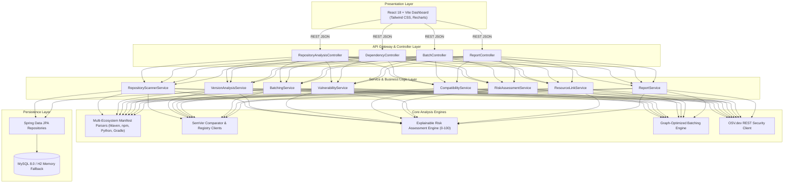

# System Architecture Specification

## 1. Overview
The **Automated Dependency Update Risk Assessment and Batching Strategy** is an explainable decision-support and automation platform built for modern DevOps and DevSecOps pipelines. It ingests GitHub repositories, analyzes dependency manifests across multiple ecosystems (Java/Maven, Node.js/npm, Python/PyPI, Gradle), correlates live security vulnerability advisories (via OSV.dev), evaluates compatibility and breaking change drift, calculates a normalized 5-dimensional risk score ($0 - 100$), and synthesizes conflict-minimized, safe dependency update batches.

---

## 2. Layered Architecture

---

## 3. Core Subsystems

### 3.1 GitHub Repository & Manifest Ingestion Subsystem
- **`GitHubApiClient`**: Parses repository URL, extracts owner, name, and target branch. Queries GitHub Tree API (`/git/trees/{branch}?recursive=1`) or standard probe candidate paths with optional token authentication for private repositories and rate-limit immunity.
- **Manifest Parser Factory**: Implements the Factory Pattern to route manifest files to dedicated parser instances:
  - `MavenPomParser`: XML DOM parsing with property interpolation (`${property.version}`) and dependencyManagement resolution.
  - `NpmPackageJsonParser`: Semantic version constraint parsing across `dependencies`, `devDependencies`, and `peerDependencies`.
  - `PythonRequirementsParser`: Standard `requirements.txt` and `pyproject.toml` (PEP 621 / Poetry) parsing.
  - `GradleBuildParser`: Groovy and Kotlin DSL block matching for `implementation`, `api`, and `testImplementation`.

### 3.2 Live Intelligence & Registry Subsystem
- **`VersionAnalysisService`**: Queries official registries (`registry.npmjs.org`, `pypi.org`, `repo1.maven.org`) to fetch latest stable releases, release dates, repository URLs, and deprecation flags.
- **`OsvVulnerabilityClient`**: Queries the Open Source Vulnerabilities (OSV.dev) API in real time using package ecosystem and current version to detect CVE / GHSA advisories, CVSS severity scores, affected ranges, and fixed versions.

### 3.3 Explainable Risk Assessment Engine
- Implements a mathematical 5-factor scoring model that normalizes composite risk to a $0 - 100$ scale, categorizing into `LOW`, `MEDIUM`, `HIGH`, or `CRITICAL`.
- Outputs itemized additive reasons explaining the mathematical score computation.

### 3.4 Graph-Optimized Batching Engine
- Clusters dependencies into prioritized, actionable batches:
  1. `URGENT_SECURITY`: Quarantines Critical and High vulnerabilities into isolated security hotfix PRs.
  2. `SAFE_PATCHES`: Atomic grouping of backward-compatible patch updates.
  3. `MINOR_UPDATES`: Backward-compatible minor feature bumps requiring staged integration testing.
  4. `ISOLATED_MAJOR`: Isolates major version breaking changes into individual migration PRs.
- Generates reproducible CLI terminal execution commands and automated GitHub PR descriptions.
