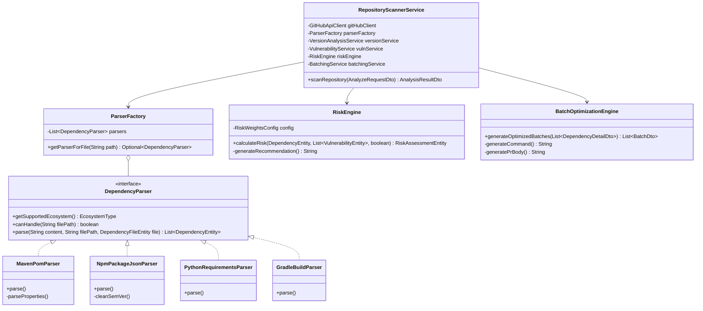

# Object-Oriented Class Diagram & Design Patterns

## 1. Class Hierarchy & Design Patterns

---

## 2. Software Design Patterns Implemented
1. **Factory Pattern (`ParserFactory`)**: Encapsulates dynamic manifest parser instantiation and selection based on file extension and content structure.
2. **Strategy Pattern (`DependencyParser`, `BatchOptimizationEngine`)**: Isolates ecosystem-specific parsing and batch optimization algorithms, allowing new ecosystems (e.g. Go, Rust) to be added without modifying core pipeline controllers.
3. **Data Transfer Object (DTO) Pattern**: Decouples internal JPA entities from external REST serialization schemas to prevent over-fetching and recursive relationship cycles.
4. **Adapter / Client Pattern (`GitHubApiClient`, `OsvVulnerabilityClient`)**: Wraps heterogeneous external REST endpoints and normalizes external JSON payloads into unified internal domain models.
