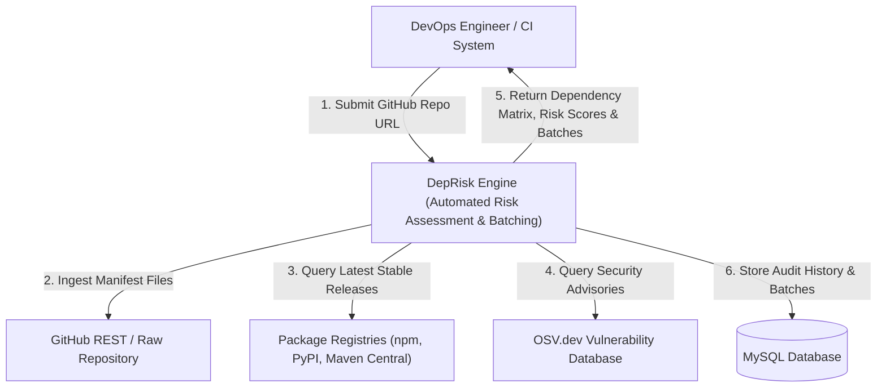
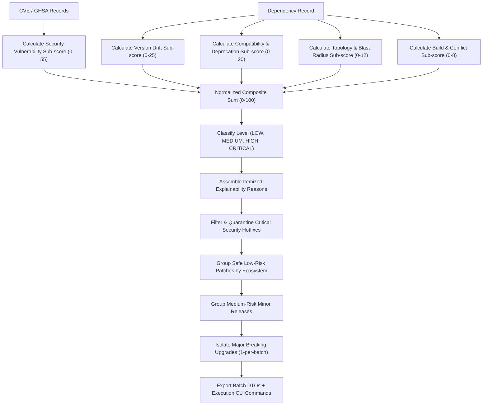

# Data Flow Diagrams (DFD)

## 1. Level-0 Context Data Flow Diagram



---

## 2. Level-1 Data Flow Diagram (Functional Decomposition)

```mermaid
graph TD
    User["DevOps Engineer"] -->|Repository URL| P1["1.0 URL Validation & Manifest Ingestion"]
    P1 -->|Fetch Manifests| GitHub["GitHub Service"]
    GitHub -->|Raw Manifest Contents| P2["2.0 Multi-Ecosystem Manifest Parsing"]
    P2 -->|Normalized Dependencies| Store1[("D1: Extracted Dependencies")]

    Store1 --> P3["3.0 Live Version & Registry Lookup"]
    P3 -->|Query dist-tags| Registries["npm / PyPI / Maven Central"]
    Registries -->|Target Version & Deprecations| Store2[("D2: Version Intelligence")]

    Store1 --> P4["4.0 Security Vulnerability Scanner"]
    P4 -->|Query package & version| OSV["OSV.dev REST API"]
    OSV -->|CVE/GHSA & Severity| Store3[("D3: Active Vulnerabilities")]

    Store2 & Store3 --> P5["5.0 Explainable Risk Assessment Engine"]
    P5 -->|5-Factor Risk Score (0-100) & Reasons| Store4[("D4: Risk Assessments")]

    Store4 --> P6["6.0 Batching Strategy & Graph Optimization"]
    P6 -->|Quarantine Critical & Group Patches| Store5[("D5: Generated Batches")]

    Store4 & Store5 --> P7["7.0 Executive Audit & Report Generation"]
    P7 -->|Interactive UI Dashboard & PDF/MD Export| User
```

---

## 3. Level-2 Data Flow Diagram (Risk Assessment & Batching Engine)


