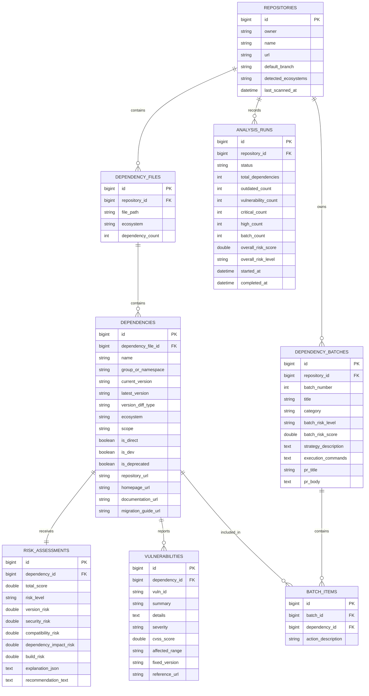

# Entity-Relationship (ER) Database Model

## 1. Relational Schema Diagram

```mermaid
erDiagram
    REPOSITORIES ||--o{ DEPENDENCY_FILES : contains
    REPOSITORIES ||--o{ DEPENDENCY_BATCHES : owns
    REPOSITORIES ||--o{ ANALYSIS_RUNS : records

    DEPENDENCY_FILES ||--o{ DEPENDENCIES : contains

    DEPENDENCIES ||--|| RISK_ASSESSMENTS : receives
    DEPENDENCIES ||--o{ VULNERABILITIES : reports
    DEPENDENCIES ||--o{ BATCH_ITEMS : included_in

    DEPENDENCY_BATCHES ||--o{ BATCH_ITEMS : contains

    REPOSITORIES {
        bigint id PK
        string owner
        string name
        string url
        string default_branch
        string detected_ecosystems
        datetime last_scanned_at
    }

    DEPENDENCY_FILES {
        bigint id PK
        bigint repository_id FK
        string file_path
        string ecosystem
        int dependency_count
    }

    DEPENDENCIES {
        bigint id PK
        bigint dependency_file_id FK
        string name
        string group_or_namespace
        string current_version
        string latest_version
        string version_diff_type
        string ecosystem
        string scope
        boolean is_direct
        boolean is_dev
        boolean is_deprecated
        string repository_url
        string homepage_url
        string documentation_url
        string migration_guide_url
    }

    VULNERABILITIES {
        bigint id PK
        bigint dependency_id FK
        string vuln_id
        string summary
        text details
        string severity
        double cvss_score
        string affected_range
        string fixed_version
        string reference_url
    }

    RISK_ASSESSMENTS {
        bigint id PK
        bigint dependency_id FK
        double total_score
        string risk_level
        double version_risk
        double security_risk
        double compatibility_risk
        double dependency_impact_risk
        double build_risk
        text explanation_json
        text recommendation_text
    }

    DEPENDENCY_BATCHES {
        bigint id PK
        bigint repository_id FK
        int batch_number
        string title
        string category
        string batch_risk_level
        double batch_risk_score
        text strategy_description
        text execution_commands
        string pr_title
        text pr_body
    }

    BATCH_ITEMS {
        bigint id PK
        bigint batch_id FK
        bigint dependency_id FK
        string action_description
    }

    ANALYSIS_RUNS {
        bigint id PK
        bigint repository_id FK
        string status
        int total_dependencies
        int outdated_count
        int vulnerability_count
        int critical_count
        int high_count
        int batch_count
        double overall_risk_score
        string overall_risk_level
        datetime started_at
        datetime completed_at
    }
```
