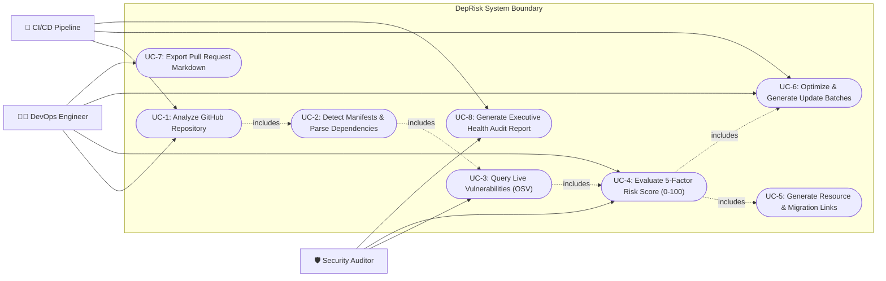

# UML Use Case Specifications

## 1. Actors
1. **DevOps Engineer / Developer**: Primary user who submits GitHub repository URLs, reviews risk scores, inspects dependencies, and triggers automated update batches.
2. **Security Auditor / Compliance Officer**: Reviews repository health grades, active CVE vulnerabilities, CVSS scores, and remediation roadmaps.
3. **CI/CD Pipeline (Jenkins / GitHub Actions)**: Automated headless agent triggering scans on repository commit/pull request triggers.
4. **External Registries & Vulnerability Services (OSV.dev, npm, PyPI, Maven Central)**: Secondary external systems providing live version metadata and security advisories.

---

## 2. Use Case Diagram

---

## 3. Detailed Use Case Specifications

### UC-1: Analyze GitHub Repository
- **Primary Actor:** DevOps Engineer / CI/CD System
- **Preconditions:** Network connectivity to GitHub API or raw repositories.
- **Main Success Scenario:**
  1. Actor enters a valid GitHub repository URL (e.g. `https://github.com/spring-projects/spring-petclinic`).
  2. System validates repository URL and extracts owner and repository name.
  3. System inspects the repository directory tree for supported manifest files (`pom.xml`, `package.json`, `requirements.txt`, `build.gradle`).
  4. System parses all detected manifests and normalizes dependency entities.
  5. System returns complete dependency inventory, vulnerabilities, risk scores, and generated batches.

### UC-6: Optimize & Generate Update Batches
- **Primary Actor:** DevOps Engineer
- **Preconditions:** Dependency inventory and risk calculation completed.
- **Main Success Scenario:**
  1. System isolates critical and high security vulnerabilities into dedicated immediate security hotfixes.
  2. System clusters compatible low-risk patch updates into atomic batch PRs.
  3. System groups backward-compatible minor feature updates into staging validation batches.
  4. System isolates high-risk major updates with breaking changes into individual migration batches.
  5. System outputs terminal update commands and copy-paste GitHub PR Markdown templates.
